# Neural Network

## Neural Network intuition

### Demand Prediction

- Can think neuron as a small computer whose only job is to input one number of few numbers

  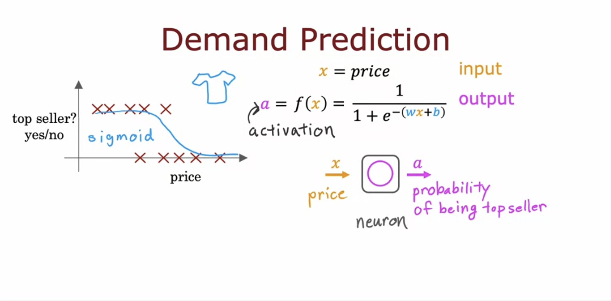

- Each neuron as a logistic regression unit
- In neuron network, we group neuron together called layer
- The out put of a neuron is activations (activation value)
- Use 4 number to compute 3 number then use 3 number to compute 1 number
- Go through the neurons one at a time and decide what inputs it will take from previous layer.
- Write features as vector
- Hidden layer: You gey observation x and y but don't tell others like affordability so it called hidden layer

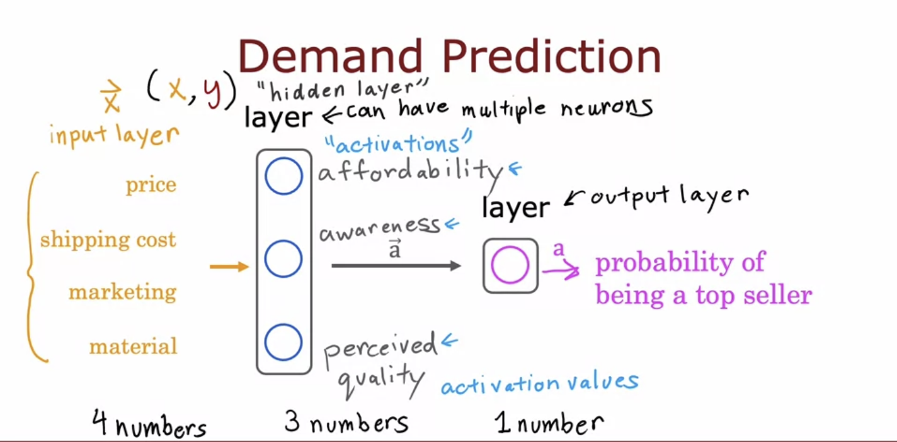

#### Ps: Layers can be multiple

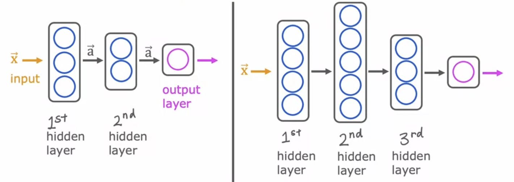

### Example: Recognizing Images

- ####  Picture is 1000x1000 pixels like 1000x1000 grid

- #### 0-255 represent colors

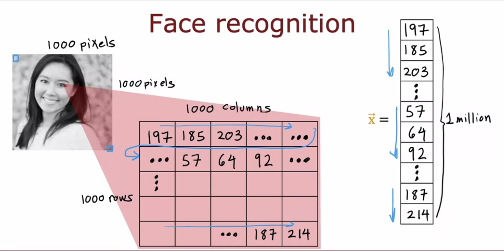

- #### **Neuron Net work**

- #### First hidden layer (Very short lines or very short edges): 

  First neuron looking for low vertical linFe or vertical edge

  Second neuron looking for oriented line or oriented edge

  Third looking for a line in that orientation

- #### Second hidden layer (Learn to group together lots short lines and little short edge segments in order to looks for parts of faces)

- #### Next hidden layer (Aggregating different parts of faces to detect presence or absence of larger coarser face shapes)

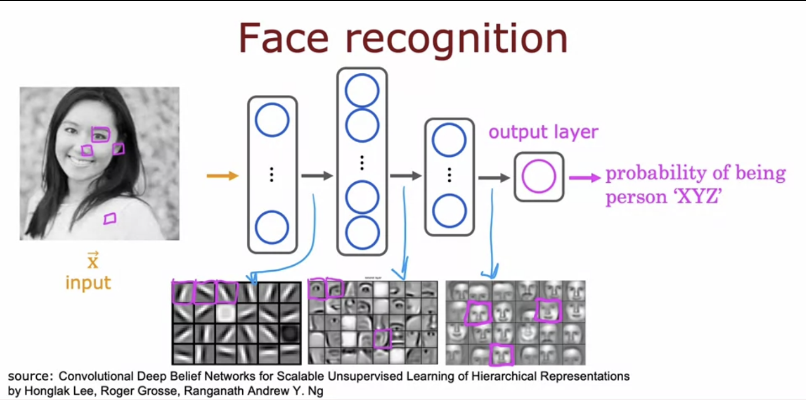

- #### Car is samilar: lines or egdes -> car parts -> car shape

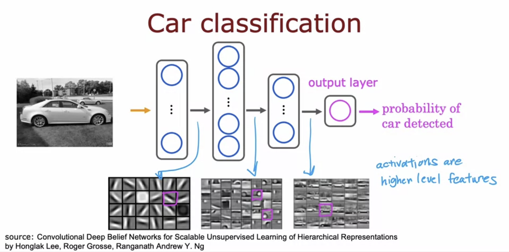

## Neural newwork model

### Neural network layer

- Each neuron implement a logistic regression

- Output (vector of activation values) of layer 1 become input of layer 2

#### Layer 1

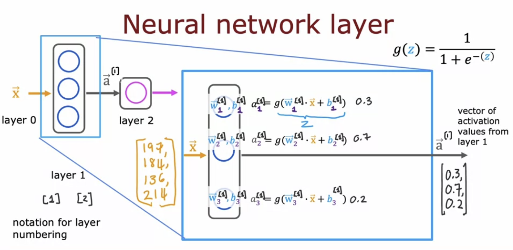

#### Layer 2

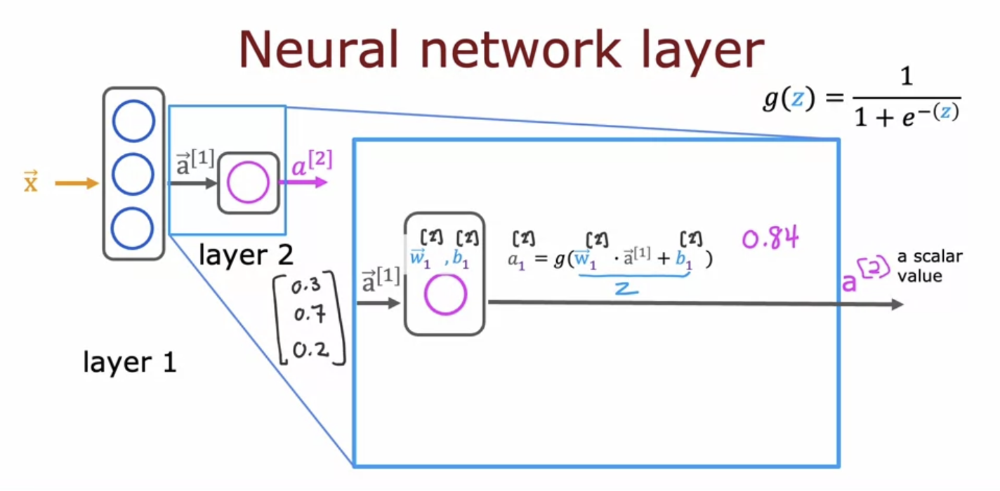

#### Output

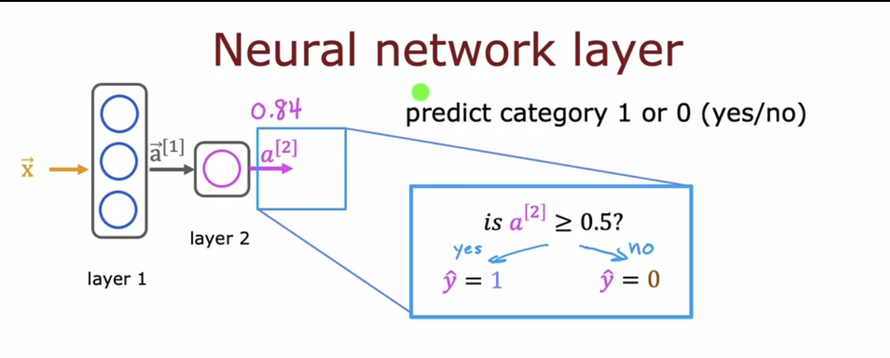

### More complex neural networks

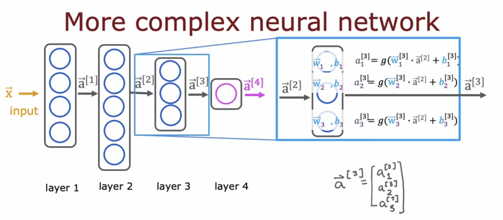

#### Notation

- Activation function is the function that outputs these activation values

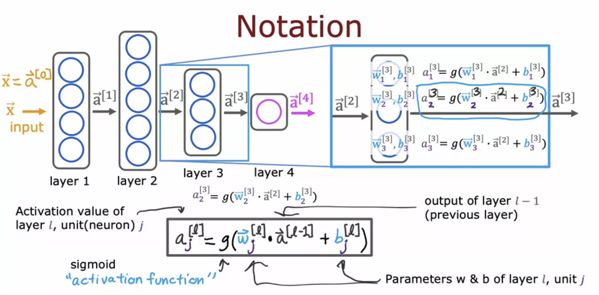

### Inference: making predictions (forward propagation)

#### Example: Handwritten digit recognition

- Computer a^[2]

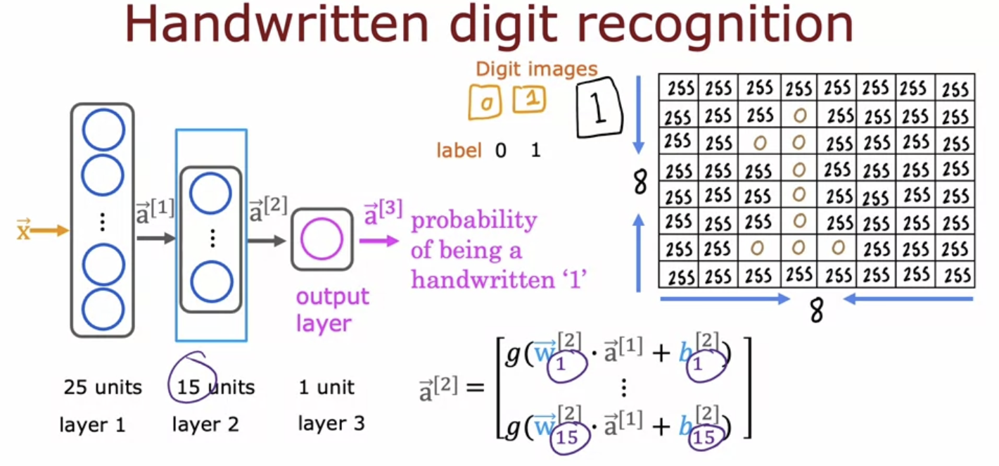

- Computer a^[3]

  **forward propagation**: Algorithm that do computation goes from left to right

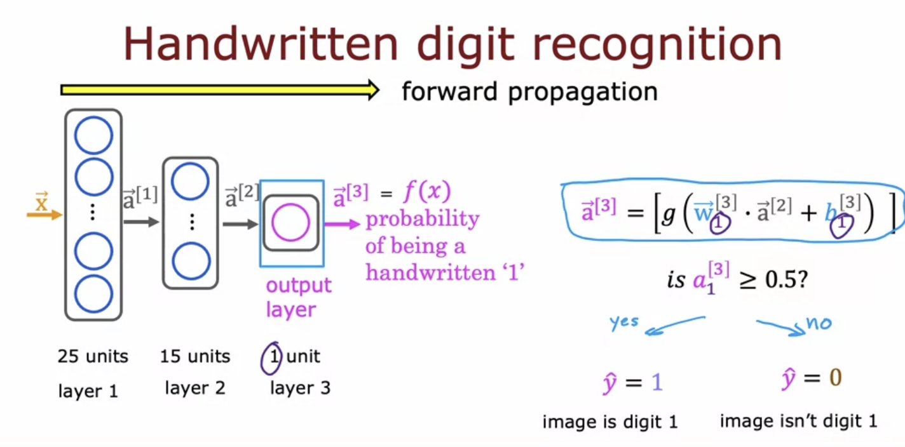

