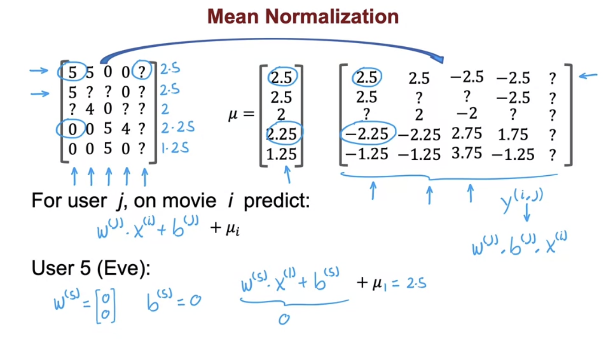

# Recommendation System

### Using per-item features

#### Example: Predicting moview ratings

- Some number of users and items

- **Add feature for each movie**

  Then have linear regression modle of vectors

  

  - **w和b的superscript表示第几个user**

  

  - **Cost function for each user j to learn w, b**

  

  

  

- **PS: 后半段橙色的是 Regularization term**

#### What if there is no feature for items (Collaborative  filtering)

- **w(j) * x(i)** should approximately equal to actual rate

- **Can take reasonable guess** at waht lists a feature

  

  

  - **Cost function for item i to learn x(i)** 

    

  - **j:r(i,j) = 1 表示只计算r(i,j)为1时的j**

  

  - **Collaborative filtering algroithm**
  
    - Because multiple users have rated the same movie collaboratively, give you a sense of what this movie maybe like, allow you to guess what are approprite features for that movie, then allow you to predict how other users that havn't rated that movie ay decide to rate it in the future
    - The underlying idea behind collaborative filtering is that people with similar tastes in the past are likely to have similar tastes in the future.
    - It does not require information about the items themselves or their characteristics, and it can handle new items that have not been rated before. 

    
  
    

#### Collaborative filtering with binary labels

- **1** mean like **0** mean don't like

- Many way to find 1 or 0

  

  

  

  

- **Using logistic regression**

  

  

  - **Binary cross entropy cost function**

    

# Implementation

## Mean normalization

- New user may be think they will rate all movies with zero

- Calculate averge of every item (row)
- Each row substract average
- Help for predict users who have rated no movies or very small numbers of movies
- One other alternative is using normalzation of columns (For new items), but not very useful

## TensorFlow implementation of collaborative filtering

### TensorFlow: Used  to compute the derivative

- Main work is telling how to compute the cost function J and the rest of the syntax causes TensorFlow to automatically figure out for you what is the derivative
- It is called **Auto Diff**

**Simple example (J = (wx - 1)^2:**

### Implement the collaborative filtering algorithm by TensorFlow

- Start with specifying that the optimizer is **keras optimizers "Adam"** with learning rate specified here
- **Ynorm** is ratings **mean normalized**, **R** is **r(i,j)**
- **zip()**  is the function that rearranges the numbers into an appropriate ordering for the applied gradients function

## Finding related items

- The featurs x(i) of item i are quite hard to interpret

### Limitations of Collaborative Filtering

- Start with  a new user or item
- Don't give a natural wat to use side information or additional information about items and users (item 和 user 的具体信息，Genre, ovie stars, demographics, location, web browser)

# Content-based filtering

## Collaborative filtering vs Content-based filtering

#### Collaborative filtering:

- Recommend items to users based on **ratings** of users who **gave similar ratings**

#### Content-based filtering:

- Recommend items to users based on **features of user and item** to **find good match**
- It requires having some features of each user as well as some features of each item
- It uses those features to try to decide which items and users might be a good match for each other

### Example:

 

- Using dot production 
- Thus two vector should be same size

## Deep learning for content-based filtering

