# Machine learning

## Definition

- Field of study that gives computers the ability to learn without being explicity programmed

### Machine learning algorithms

- Supervised learning

  Used mostly in real-world application

  

- Unsupervised learning

- Recommender systems

- Reinforcement learning

  

## Supervised learning

**Input -> output label** mapping

Learns from being given "**Right answers**"

Ex:

**Regression**: particular type of supervised learning

- Predict a number 
- Infinitely many possible outputs

**Classification**: 

- predic categories (can be non-number) with small number of possible outputs

The learning algorithm has to decide **how to fit a boundary line** through this data

## Unsupervised learning

- Find something interesting in **unlabeled data**
- Data only comes with input x, but not output labels y
- Algorithm has to find structure in the data

### Clustering

- Grouping data into clusters
- Algorithm figure out how to group data without supervision

### Anomaly detection

- Find unusual data points

### Dimensionality reduction

- Compress data using fewer numbers

  

# Linear Regression

**w,b also called parameters, coefficients, weight**

### Cost function

- Takes the prediction **y hat** and compares it to the target y by taking y hat minus y
- Tell how well the model is working, measure the difference between the model prediction(y hat) and the actual true value(y).

- **Division 2** in **1/2m** just to make following calculation neater
- Differenr people may use different cost function for different application

### Cost function intution

#### - Find minimize of cost function

**When w =1:**

**When w = 0.5:**

**When w = 0:**

**The final plot is:** 

**When w = 1, J(w) is minimum**

#### **J(w,b)**

### Gradient Descent

- Have **J(w1, w2, .... , wn, b)**, want to **min J(w1, w2, .... , wn, b)**

- Gradient descent is **an algorithm for finding values of parameters w and b** that minimize the cost function J

  

  

- How gradient descent work?

  

#### Gradient descent algorithm

- Alpha is **learning rate**（Control how big step to take)

- Using **derivative**

- **Repeat until convergence**(收敛)

- **Simultaneously**(同时) update **w** and **b**

  

#### Derivative review

- d/dw J(w) is the **slope**

  
  
  

#### Learning rate

- Find learning rate

  

  

  

  

  - Detivative 会先大后小

    

  

  #### Gradient descent for linear regression

  

  

  - **Global minmum** is what we want finally (**local mimimum** not good enough)

    

  

  - **Batch gradient descent**
  
    

# Multiple features in Linear Regression

#### Example:

### Vectorization

- Make code shorter and make it run much more efficiently
- Take advantage of modern **numerical linear algebra libraries (NumPy)**

- For loop run one by one, one step one time
- Get value together and calculate all entries in parallel, much faster

### Gradient descent in multiple linear regression

- **Normal equation** mwthod may be used in machibe learning libraries that implement linear regression
- **But Gradient descent is ts the recommended method!**

## Feature scaling

- Very small changes to w1 can have large impact, so w1 should be small
- It takes a much larger change in w2 in order to change the presictions much, so w2 should be small

### Scale features: Performing some transformation of your training data (x1 and x2 is scaled both 0-1)

- Can speed gradient descent significantly

### How to scaling feature?

#### Feature scaling

#### Mean normalization

- Have both negtive and positive number

#### Z-score normalization

### No harm to carry feature scaling

## Checking gradient descent for convergence

## Choosing the learning rate

- **One important trade-off is that if learning rate is too small, take a lot of iterations to converge**

### Trying the value for learning rate

## Feature engineering

- The **choice of feature**s can have a huge impact on your learning algorithm's performance

## Polynomial regression

- **Curve regression**
- **Feature scaling is very important**

# Classification

## Logistic regression (Curve)

#### What logistic regression output mean?

## Decision Boundary

**Set threshold(临界) above which you predict y is one**

- **Non-linear decision boundaries**

  

  
  
  

## Cost function for logistic regression

- Target lable y is only 0 or 1
- How can we chose **w** and b

- Squared error cost function for logistic is non-convex
- Lots of local minmum
- Need another cost function to make it convex to use gradient dscent

### Loss Fucntion

- x-axis is **model fucntion**
- y-axis is **loss**
- Loss apply yo single training example but cost apply to entire training example

#### y is equal to 1

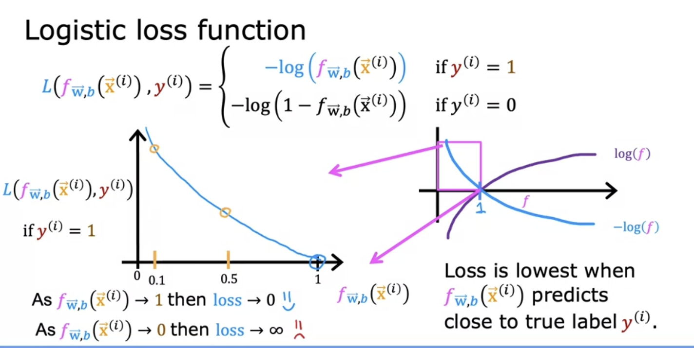

#### y is equal to 0

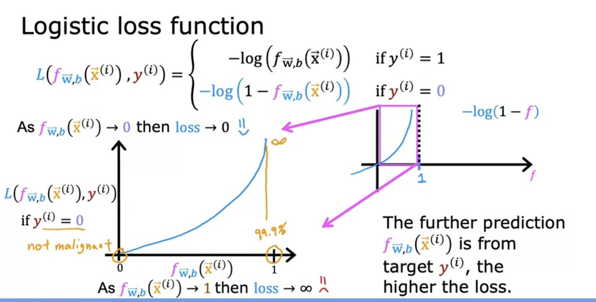

#### The cost function:

- Cost function is a function of the entire training set, the average of the loss function on the individual training examples

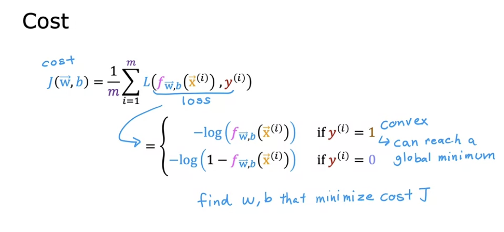

### Simplified loss function

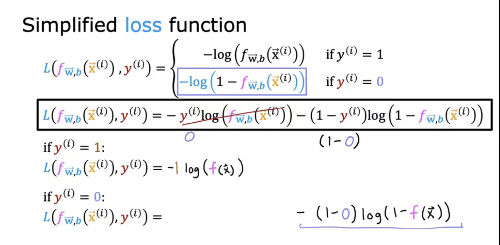

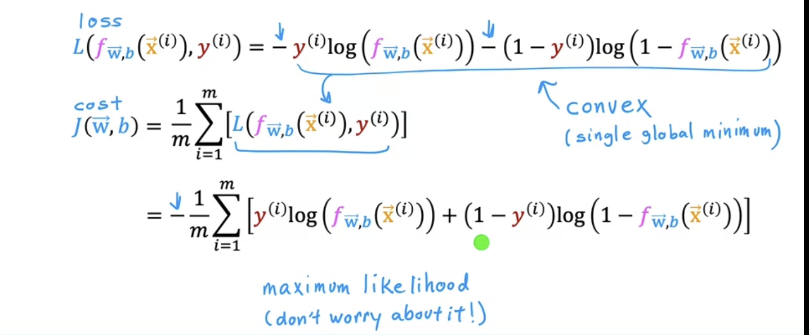

- This cost fucntion is derived from statistics using a statistical principle
- Maximum likehood estimation

## Gradient Descent Implementation

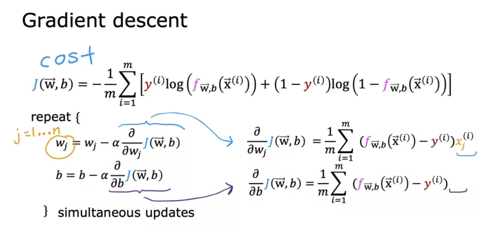

- Their deriviavte is same but the defination of f is diff

## Overfitting

- **Bias**: if the algrothm is underfit the data meaning that it's just not even able to fit the training set well

  

- **Overfit**: if the data over fit the data too "Well", model may generalize new examples poorly, if your tarining set were just evenr a little bit different, the function that the algorithm fits could end up being totally different (High variance)
- Ex: large size lead to low price like the third picture

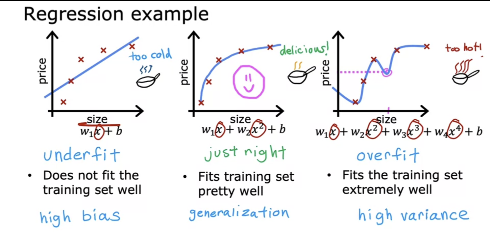

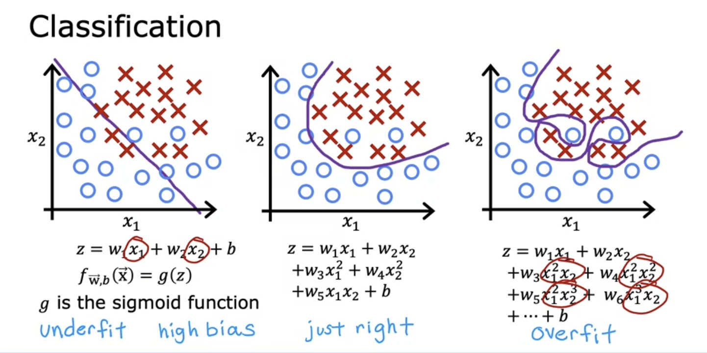

### Regularization to Reduce Overfitting

- Collect more tarining examples may works
- Use less polynomial features may works (**Feature selection**), but useful features may loss

#### **Regularization**

- More gently reduce the impacts of some of reatures, reduce size of parameters

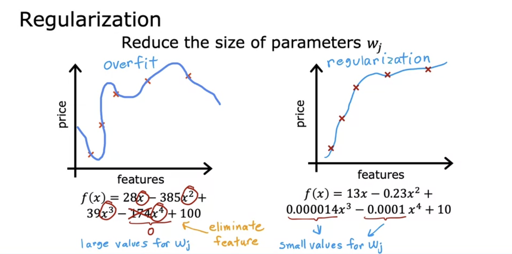

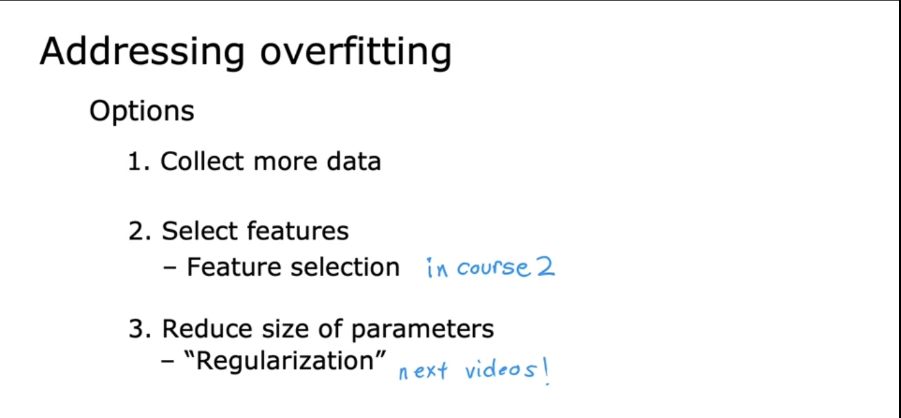

### Cost function with regularization

- If have a lot of features, don't know which are the most improtant fdeatures and which ones to penalize
- Penalize all of the features(penalize all the parameters)

- lambda is regularization parameter

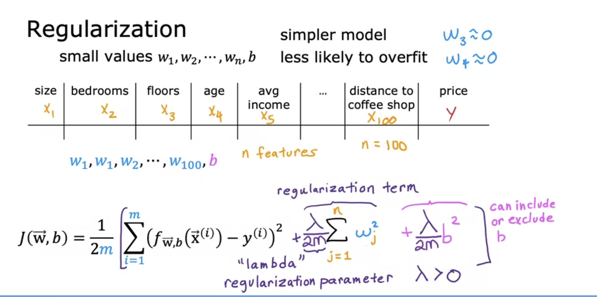

- This new cost function trades off two goals:
- Trying to minimize this first term encourages the algorithm to fit the training data well by minimizing the squared differences of the predictions and actual value
- Trying to minimize the second term, the algorithm also tries to keep the parameters wj small which tend to reduce overfitting
- If lambda is very large, to minimize the cost function wj must be very small(close to 0)

### Derivative

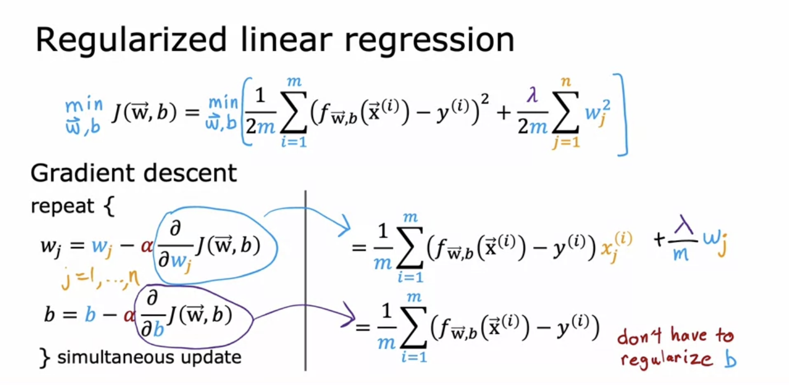

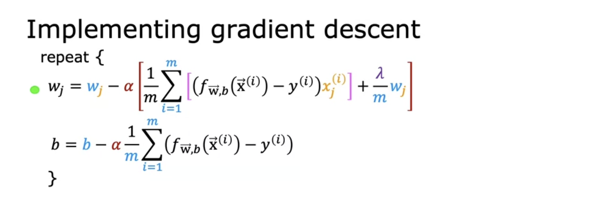

- Shrink wj, mutiplying some percent to wj (like 0.998)

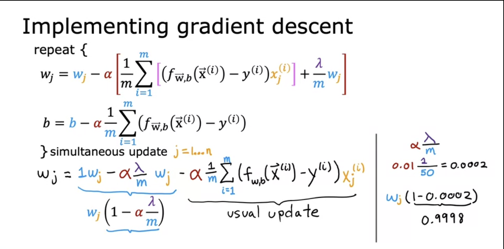

### Regularized logistic regression

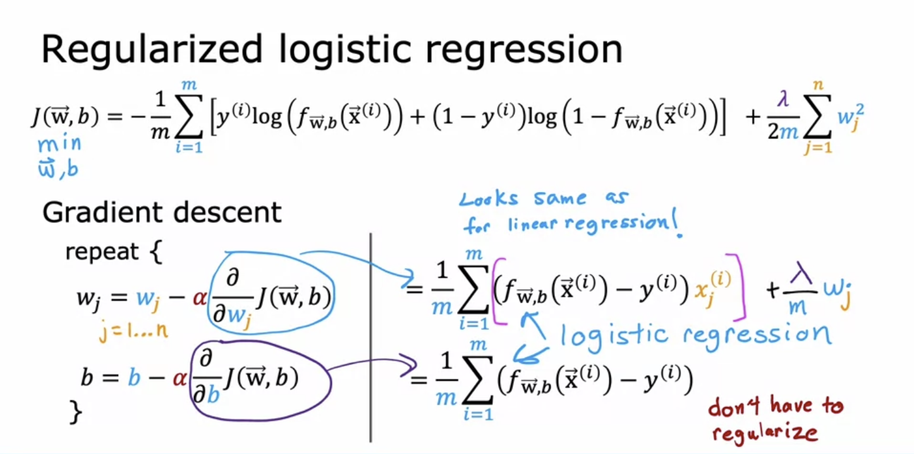

